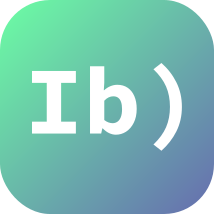

# Ibrowse
_"Yeah man, Ibrowse!"_

## Overview
Ibrowse is the browser for those who love:

- **Minimalism🎛️** Ibrowse has a very lightweight UI, and doesn't bombard you with actions and widgets.

- **Security🔐** Ibrowse is incredibly secure, as everything is stored on your local machine.

- **Ease Of Use🍰** Ibrowse doesn't require special knowledge to use it.

## Speed
Ibrowse' GUI is implemented in Python/PyQt, while a Rust backend handles things like
user passwords, bookmarks, and recent tabs. This makes Ibrowse very fast for day-to-day use.

## Free And Open-Source
Ibrowse is 100% free with no drawbacks or limitations. There is no "premium" version; you get
the latest and greatest, all licensed under the GPL. Prebuilt binaries are available for MacOS 
and Windows.
