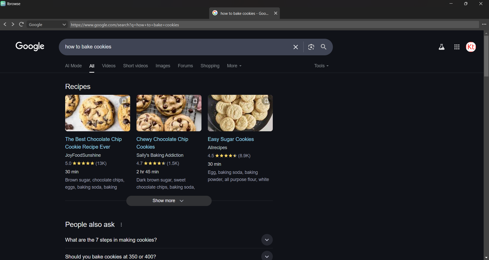

# Ibrowse
_"Yeah man, Ibrowse!"_

## Overview
Ibrowse is the browser for those who love:

- **Minimalism 🎛️** Ibrowse has a very lightweight UI and doesn't bombard you with actions and widgets.

- **Security 🔐** Ibrowse is incredibly secure, as everything from bookmarks to passwords are stored entirely on your local machine.

- **Ease Of Use 🍰** Ibrowse doesn't require special knowledge to use it, you can cut to the chase and start browsing!

## Unique UI
> Where's my "+" button?!

No need for that, just double click anywhere on the tab bar to insert a tab. Additionally,
jump to the search bar with `Ctrl+Q`.

## Speed
Ibrowse' GUI is implemented in Python, while a Rust backend handles things like
user data, caches, and tabs storage. This makes Ibrowse fast for users.

## Free And Open-Source
Ibrowse is 100% free with no drawbacks or limitations. There is no "premium" version; you get
the latest and greatest, all licensed under the GPL. Ibrowse currently only supports Windows, 
but can be run on macOS and Linux by cloning this repository.
